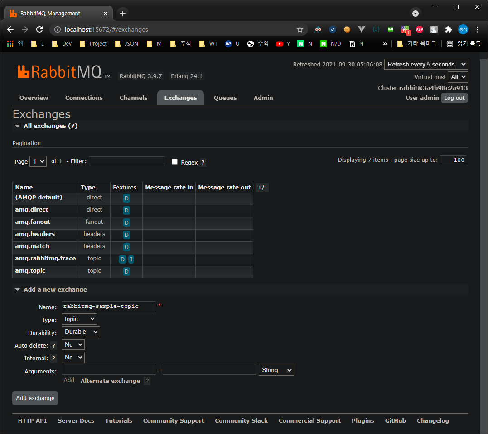

RabbitMQ project 관련 사항
===

## RabbitMQ project 실행을 위한 환경 설정

 - RabbitMQ admin URL : http://localhost:15672/#/exchanges
   - Exchanges > Add a new exchange
     - Name : RabbitMQConfig.java의 RABBIT_EXCHANGE_NAME값
     - Type : topic